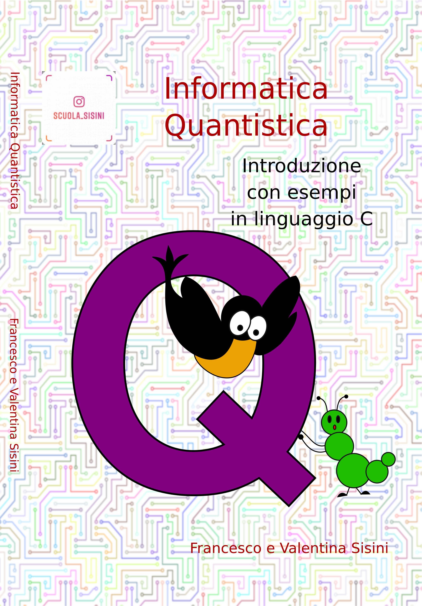

# Informatica Quantistica, introduzione con esempi in linguaggio C
Il libro è disponibile su [Amazon](https://www.amazon.it/Informatica-Quantistica-introduzione-esempi-linguaggio/dp/B0858VQZ17)

E' disponibile un [estratto](estratto.pdf) 

I computer quantistici si stanno affacciando sul panorama tecnologico e presto saranno disponibili sul mercato. Il loro principio di funzionamento è molto complesso perché si basa sulla meccanica quantistica, scienza di cuial momento non vengono insegnati i fondamenti né alle scuole superiori né nei corsi universitari che non sianospecialistici come Fisica o AstronomiaLa situazione è molto simile a quella che si delineò alla fine degli anni '50, quando chi non aveva le basi di elettronica non poteva in alcun modo ambire a comprendere il funzionamento di un calcolatore elettronico. Sebbene la conoscenza dell'elettronica sia fondamentale ancora oggi per chi voglia fare dell'informatica la propriaprofessione, è vero che è possibile programmare un computer anche senza conoscere questa disciplinaIn questo libro, l'autore estrapola dalla meccanica quantistica solo i principi base necessari per la comprensionedel nuovo paradigma di programmazione. Il risultato è l'apertura della possibilità di comprendere le basi della programmazione di algoritmi quantistici anche a chi non ha studiato FisicaPer ogni argomento trattato il libro propone i relativi esercizi di computazione quantistica. Dal momento che i computer quantistici non sono ancora diffusi, nel testo vengono presentati degli esercizi scritti in il linguaggio C, usando i quali è possibile mettere in pratica i concetti appresi. Gli autoriFrancesco Sisini è laureato in fisica, ha un master in Fisica nucleare e un dottorato di ricerca in tecniche radioisotopiche. Hainiziato a seguire il mondo informatico dalle scuole medie e si occupa attivamente di didattica e formazione aziendale nel campo del Machine Learning e delle reti neurali. E' primo autore di diversi pubblicazioni su riviste scientifiche internazionaliValentina Sisini è studentessa di informatica. E' responsabile dei prodotti di Scuola Sisini.

